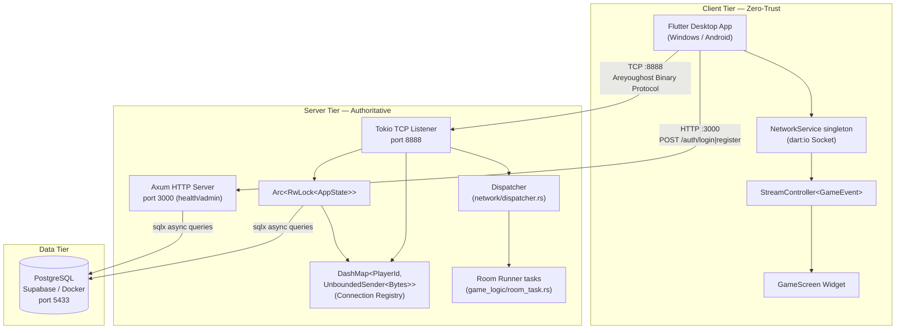
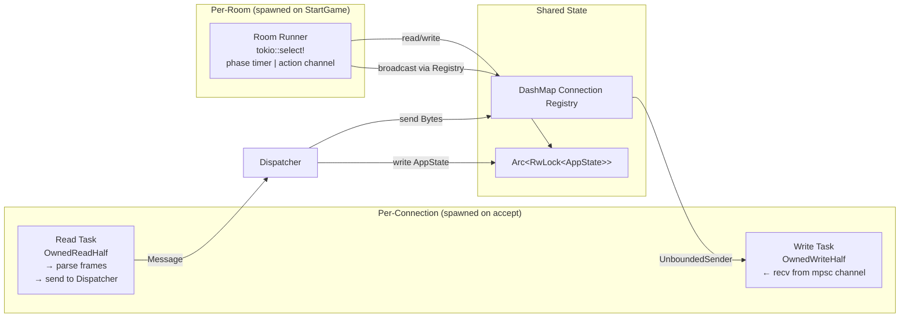
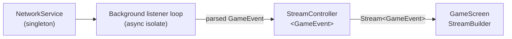
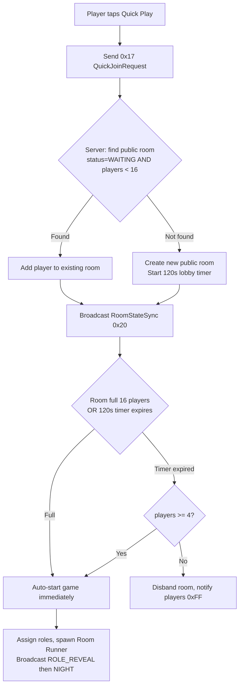
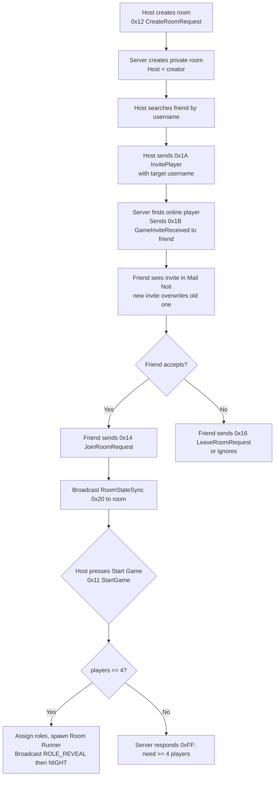
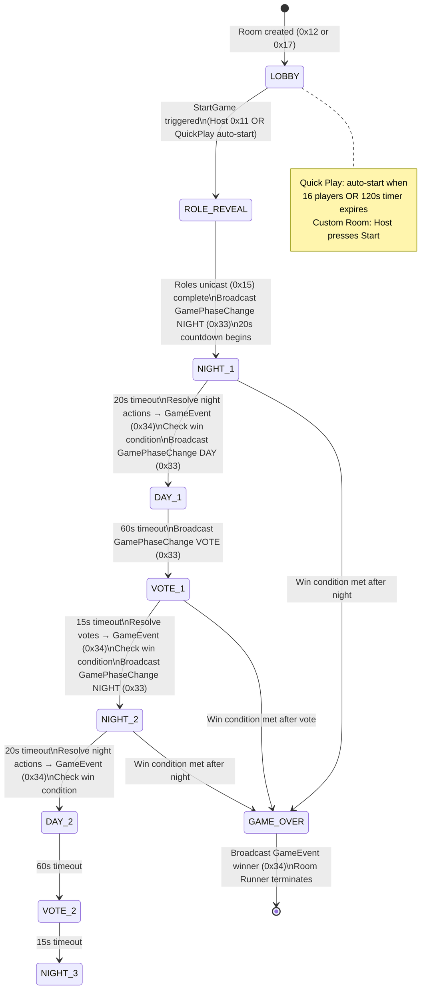
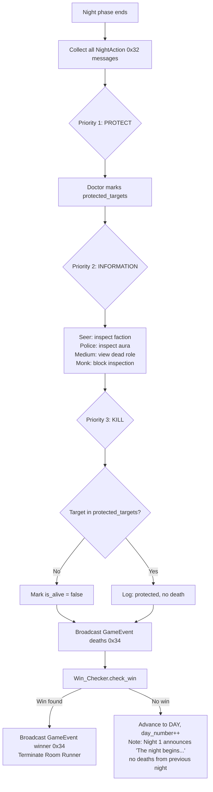
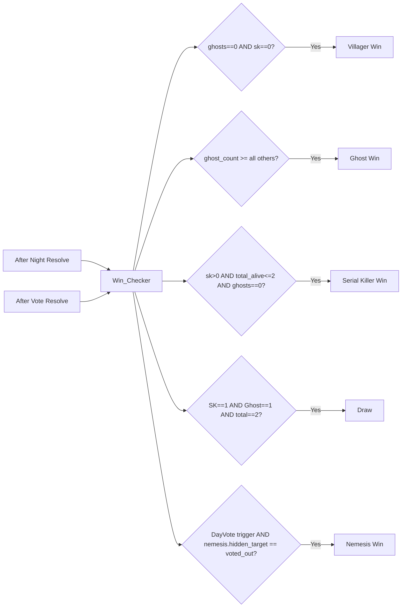
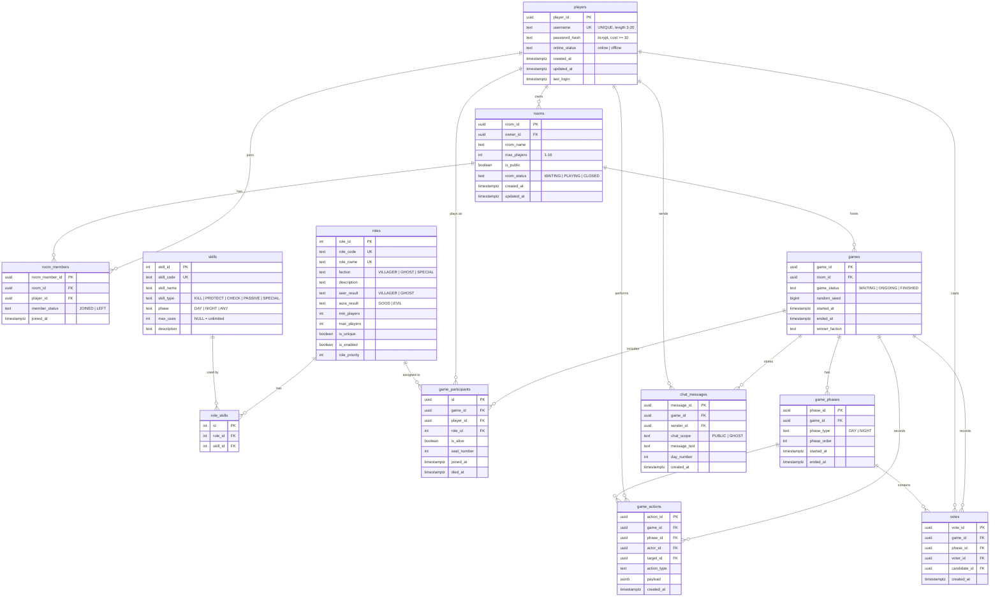

# Design Document — Build Stabilization & Service Recovery
## Are You Ghost? — End-to-End Multiplayer Playability

---

## Overview

This document describes the technical design for wiring the "Are You Ghost?" game into a fully playable end-to-end multiplayer system. The existing codebase has a stable Flutter frontend, a Rust `core/` library with game logic modules, and a PostgreSQL database. What is missing is the authoritative server-side connection management, command dispatching, game loop orchestration, a continuous Flutter listener, and database seed data for the 16 official roles.

The design follows a **Zero-Trust Client Isolation** model: the Flutter client holds no database credentials and communicates exclusively through the Areyoughost binary protocol over TCP port 8888. All game state mutations are authoritative on the server.

---

## Architecture

### 1. System Architecture

The system is composed of three tiers connected by the Areyoughost binary protocol and SQL respectively.



**Zero-Trust Isolation**: The Flutter client never opens a database connection. It serializes user actions into binary frames and sends them to port 8888. The Rust server is the sole authority over all state mutations and database access.

**Dual-Port Design**:
- TCP 8888 — Areyoughost binary protocol (game traffic)
- HTTP 3000 — Health check, admin endpoints, and REST auth (login/register)

### 1.1 Server-Side Concurrency Model



Each accepted TCP connection spawns exactly two Tokio tasks (Read + Write). The Write task owns the `OwnedWriteHalf` and drains an `mpsc::UnboundedReceiver<Bytes>`. The Read task owns the `OwnedReadHalf`, parses complete Areyoughost frames, and forwards `Message` structs to the Dispatcher. When either task terminates, it cancels the sibling and removes the player from the Connection Registry.

Each active game room has one Room Runner task that drives the phase machine via `tokio::select!` over a phase timeout and an inbound action channel.

### 1.2 Flutter Client Architecture



`NetworkService` exposes a `Stream<GameEvent>` that `GameScreen` subscribes to via `StreamBuilder`. The background loop continuously reads and parses Areyoughost frames from the socket, deserializes payloads with Bincode, and pushes typed events into the `StreamController`.

### 1.3 Room Management Modes

The system supports two distinct room modes with separate server routing logic:

#### Mode 1: Quick Play (Public Matchmaking)



- No host required — game starts automatically.
- Background: use `DayTimeBg` image during the 120s lobby wait.
- Multiple public rooms can run concurrently (one per 16-player group).
- Server tracks `lobby_start_time` in `RoomState` for the 120s countdown.

#### Mode 2: Custom Room (Play with Friends)



- Only the Host can start the game (no auto-start timer).
- Invites are push-delivered via `0x1B GameInviteReceived` to the friend's active socket.
- A new invite from any host overwrites the previous pending invite in the Mail Noti UI.
- Room is private (`is_public = false`).

---

## Network Protocol Specification

### 2. Areyoughost Binary Protocol

The protocol operates over raw TCP (port 8888) and uses a fixed-header binary frame to solve the TCP sticky-packet problem via an explicit 4-byte length prefix.

#### 2.1 Frame Structure

```
 0       1       2       3       4       5       6       7
 +-------+-------+-------+-------+-------+-------+-------+
 | 0xAE  | 0x80  | Type  |      Payload Length (4B BE)    |
 +-------+-------+-------+-------+-------+-------+-------+
 |                  Payload (N bytes)                     |
 |                      ...                               |
 +-------+-------+-------+-------+-------+-------+-------+
 |    CRC16-IBM-SDLC (2B BE)     |
 +-------+-------+-------+-------+
```

| Field          | Size    | Description |
|----------------|---------|-------------|
| Magic          | 2 bytes | `0xAE 0x80` — identifies valid Areyoughost frames |
| Type           | 1 byte  | Opcode identifying the message type |
| Payload Length | 4 bytes | Big-Endian u32 — exact byte count of the payload |
| Payload        | N bytes | Bincode-serialized struct (JSON for legacy) |
| CRC16          | 2 bytes | Big-Endian u16 — CRC_16_IBM_SDLC over `[Type][Length(4B)][Payload]` |

**Minimum frame size**: 9 bytes (empty payload).  
**Maximum payload**: 10 MB (`MAX_MESSAGE_SIZE = 10_485_760`).  
**Sticky-packet resolution**: The receiver buffers bytes until `accumulated >= 9 + payload_length`, then slices exactly one frame.

#### 2.2 CRC16 Computation

```
crc_input = [type_byte] ++ length_bytes_be(4) ++ payload_bytes
checksum  = CRC_16_IBM_SDLC(crc_input)
```

The magic bytes are excluded from the CRC scope. The algorithm used is `CRC_16_IBM_SDLC` from the Rust `crc` crate (polynomial 0x1021, reflected).

#### 2.3 Full Opcode Table

| Opcode | Name               | Direction | Description |
|--------|--------------------|-----------|-------------|
| 0x01   | LoginRequest       | C→S       | Authenticate with username + password |
| 0x02   | LoginResponse      | S→C       | Returns `session_id`, `player_id`, or error |
| 0x03   | RegisterRequest    | C→S       | Create new account with username + password |
| 0x04   | RegisterResponse   | S→C       | Returns success or username-taken error |
| 0x05   | ReconnectRequest   | C→S       | Reconnect using stored session_id after socket drop |
| 0x06   | ReconnectResponse  | S→C       | Returns restored game state or error if session expired |
| 0x0F   | GetGameData        | C→S       | Request all 16 roles and skill definitions |
| 0x10   | RoomListRequest    | C→S       | Request list of open rooms |
| 0x11   | RoomListResponse / StartGame | C→S (StartGame) / S→C (RoomList) | Repurposed: host sends 0x11 to start game |
| 0x12   | CreateRoomRequest  | C→S       | Create a new lobby room |
| 0x13   | CreateRoomResponse | S→C       | Returns `room_id` or error |
| 0x14   | JoinRoomRequest    | C→S       | Join an existing lobby by `room_id` |
| 0x15   | JoinRoomResponse   | S→C       | Unicast: player's assigned role at game start |
| 0x16   | LeaveRoomRequest   | C→S       | Leave lobby or active game |
| 0x17   | QuickJoinRequest   | C→S       | Request to join or create a public matchmaking room |
| 0x18   | QuickJoinResponse  | S→C       | Returns room_id and remaining lobby wait time in seconds |
| 0x1A   | InvitePlayer       | C→S       | Host invites a friend by username to the private room |
| 0x1B   | GameInviteReceived | S→C       | Push notification to invited player's Mail Noti |
| 0x20   | RoomStateSync      | S→C (broadcast) | Full participant list with usernames and online status |
| 0x30   | ChatMessage        | C→S / S→C (broadcast) | In-game chat; day = all alive, night = ghost-only |
| 0x31   | CastVote           | C→S       | Submit vote during Vote phase |
| 0x32   | NightAction        | C→S       | Submit night skill action |
| 0x33   | GamePhaseChange    | S→C (broadcast) | Phase transition with phase type, day number, duration |
| 0x34   | GameEvent          | S→C (broadcast) | Deaths, role reveals, win announcements |
| 0x50   | Heartbeat          | C→S / S→C | Keep-alive; server echoes within 5 s |
| 0x51   | LatencyPing        | C→S       | Round-trip latency measurement |
| 0x60   | PositionSync       | C→S       | Reserved for future use |
| 0x70   | Disconnect         | C→S       | Graceful disconnect notification |
| 0xFF   | Error              | S→C       | Error response with descriptive payload |
| 0x00   | Unknown            | —         | Fallback for unrecognized opcodes |

#### 2.4 Key Payload Structures (Bincode)

```rust
// 0x01 LoginRequest
struct LoginRequest { username: String, password: String }

// 0x02 LoginResponse
struct LoginResponse { success: bool, session_id: Option<String>, player_id: Option<String>, error: Option<String> }

// 0x05 ReconnectRequest
struct ReconnectRequest { session_id: String }

// 0x06 ReconnectResponse
struct ReconnectResponse {
    success: bool,
    room_id: Option<String>,
    phase: Option<PhaseType>,
    day_number: Option<u32>,
    phase_remaining_secs: Option<u32>,
    is_alive: Option<bool>,
    role: Option<RoleInfo>,
    error: Option<String>,
}

// 0x17 QuickJoinRequest
struct QuickJoinRequest { player_id: String }

// 0x18 QuickJoinResponse
struct QuickJoinResponse { room_id: String, current_players: u32, lobby_remaining_secs: u32 }

// 0x1A InvitePlayer
struct InvitePlayerRequest { target_username: String, room_id: String }

// 0x1B GameInviteReceived
struct GameInviteReceived { from_username: String, room_id: String, room_name: String }

// 0x20 RoomStateSync
struct RoomStateSync { room_id: String, participants: Vec<ParticipantInfo>, alive_count: u32 }
struct ParticipantInfo { player_id: String, username: String, is_online: bool, seat_number: i32 }

// 0x33 GamePhaseChange
struct GamePhaseChange {
    phase: PhaseType,
    day_number: u32,
    duration_secs: u32,
    server_timestamp: u64,           // Unix epoch seconds when server started this phase
    night_chat_history: Option<Vec<ChatEntry>>,
}

// 0x34 GameEvent
struct GameEvent { event_type: GameEventType, deaths: Vec<DeathInfo>, winner_faction: Option<String>, extra: Option<serde_json::Value> }
enum GameEventType { NightResolution, VoteResult, GameOver, AvengerVengeance, NemesisWin, FoolWin }
struct DeathInfo { player_id: String, username: String, role_name: String }
```


---

## Game State Machine

### 3. Game Loop and Phase Transitions

#### 3.1 Full Game State Diagram



#### 3.2 Phase Durations and Transitions

| Phase | Duration | Trigger to Advance | Action on Advance |
|-------|----------|--------------------|-------------------|
| LOBBY (Quick Play) | Up to 120s | 16 players joined OR 120s timer | Auto-assign roles, spawn Room Runner |
| LOBBY (Custom) | Unlimited | Host sends 0x11 StartGame | Assign roles, spawn Room Runner |
| ROLE_REVEAL | ~2s | Automatic after all unicasts sent | Broadcast **NIGHT** phase start (0x33) |
| **NIGHT** | **20s** | **Timeout or all night actions received** | **Resolve actions → GameEvent (0x34), advance to DAY** |
| DAY | 60s | Timeout | Advance to VOTE, broadcast 0x33 |
| VOTE | 15s | Timeout or majority vote | Resolve votes → GameEvent (0x34), advance to NIGHT |
| GAME_OVER | — | Win condition detected | Broadcast 0x34 winner, terminate Room Runner |

**Phase order in PhaseMachine**: `Night → Day → Vote → Night → Day → Vote → ...`  
`day_number` increments after each `Night → Day` transition.

#### 3.3 Night Action Priority



#### 3.4 Special Role Triggers

| Role | Trigger | Effect |
|------|---------|--------|
| AvengerGhost | Voted out during Vote phase | Drags one random alive player to death |
| Nemesis | Hidden target voted out | Nemesis wins immediately (DayVote trigger) |
| Fool | Voted out during Vote phase | Fool wins immediately |
| Soldier | Targeted by Kill at night | Self-protect activates once (max 1 use) |
| DarkShaman | Night action | Target player is silenced for next Day phase |
| DeceiverGhost | Passive | Seer inspection returns VILLAGER instead of GHOST |
| QueenGhost | Passive | Aura inspection returns GOOD instead of EVIL |

#### 3.5 Win Condition Check Points

Win conditions are evaluated by `WinChecker::check_win()` after every phase resolution:




#### 3.6 Timer Synchronization and UI State

The server is the authoritative timer. The `GamePhaseChange (0x33)` payload includes `duration_secs` (e.g., 60 for Day) and `server_timestamp` (Unix epoch u64). The Flutter client starts a local countdown from `duration_secs` when it receives the packet. The client can compute clock drift by comparing `server_timestamp` against its local clock.

**UI State Machine for Timer**:
```
COUNTING_DOWN  →  (local timer hits 0)  →  WAITING_FOR_SERVER
WAITING_FOR_SERVER  →  (0x33 received)  →  COUNTING_DOWN
```

- When the local countdown reaches 0 but no new `0x33` has arrived, the Flutter `GameScreen` SHALL display a "Waiting for server..." overlay instead of advancing the UI phase.
- The UI MUST NOT change the displayed phase until a `0x33 GamePhaseChange` is received from the server.
- This prevents UI/server desync caused by network jitter or processing delay.

---

## Database Schema

### 4. ER Diagram



### 4.1 Key Constraints

- `players.username`: UNIQUE, length CHECK (3–20 chars)
- `roles.faction`: CHECK IN ('VILLAGER', 'GHOST', 'SPECIAL')
- `roles.aura_result`: CHECK IN ('GOOD', 'EVIL')
- `roles.seer_result`: CHECK IN ('VILLAGER', 'GHOST')
- `rooms.room_status`: CHECK IN ('WAITING', 'PLAYING', 'CLOSED')
- `games.game_status`: CHECK IN ('WAITING', 'ONGOING', 'FINISHED')
- `chat_messages.chat_scope`: CHECK IN ('PUBLIC', 'GHOST')
- `game_participants(game_id, player_id)`: UNIQUE — one participant record per player per game
- `role_skills(role_id, skill_id)`: UNIQUE — no duplicate mappings

### 4.2 Seed Data (16 Roles + Skills)

The migration inserts all 16 roles using `ON CONFLICT DO NOTHING` for idempotency:

**Villager Faction (9)**: VILLAGER, SEER, DOCTOR, SOLDIER, POLICE, MONK, MEDIUM, UNDERTAKER, FOOL  
**Ghost Faction (5)**: GHOST, QUEENGHOST, AVENGERGHOST, DECEIVERGHOST, DARKSHAMAN  
**Special Faction (2)**: SERIALKILLER, NEMESIS

**Skills (11)**: KILL, PROTECT, INSPECT_FACTION, INSPECT_AURA, BLOCK_CHECK, VIEW_DEAD_ROLE, SILENCE, SELF_PROTECT (max 1), DRAG_TO_DEATH (max 1), FOOL_VICTORY (passive), HIDDEN_TARGET_WIN (passive)


---

## Module Design

### 5. Components and Interfaces

#### 5.1 New Files

**`core/src/network/dispatcher.rs`**
```rust
pub struct Dispatcher {
    app_state: Arc<RwLock<AppState>>,
    registry: Arc<DashMap<String, UnboundedSender<Bytes>>>,
}

impl Dispatcher {
    pub async fn handle(&self, player_id: &str, msg: Message) -> Result<()>;
    async fn handle_join_room(&self, player_id: &str, payload: JoinRoomRequest) -> Result<()>;
    async fn handle_start_game(&self, player_id: &str, payload: StartGameRequest) -> Result<()>;
    async fn handle_cast_vote(&self, player_id: &str, payload: CastVoteRequest) -> Result<()>;
    async fn handle_night_action(&self, player_id: &str, payload: NightActionRequest) -> Result<()>;
    async fn handle_chat(&self, player_id: &str, payload: ChatPayload) -> Result<()>;
    async fn handle_login(&self, player_id: &str, payload: LoginRequest) -> Result<()>;
    async fn handle_register(&self, player_id: &str, payload: RegisterRequest) -> Result<()>;
    async fn handle_reconnect(&self, temp_player_id: &str, payload: ReconnectRequest) -> Result<()>;
    async fn handle_quick_join(&self, player_id: &str, payload: QuickJoinRequest) -> Result<()>;
    async fn handle_invite_player(&self, player_id: &str, payload: InvitePlayerRequest) -> Result<()>;
    async fn broadcast_to_room(&self, room_id: &str, msg: Message) -> Result<()>;
    async fn unicast(&self, player_id: &str, msg: Message) -> Result<()>;
}
```

**`core/src/game_logic/room_task.rs`**
```rust
pub struct RoomRunner {
    room_id: String,
    app_state: Arc<RwLock<AppState>>,
    registry: Arc<DashMap<String, UnboundedSender<Bytes>>>,
    action_rx: mpsc::UnboundedReceiver<RoomAction>,
}

impl RoomRunner {
    pub async fn run(mut self);
    async fn run_day_phase(&mut self) -> PhaseResult;
    async fn run_vote_phase(&mut self) -> PhaseResult;
    async fn run_night_phase(&mut self) -> PhaseResult;
    async fn broadcast_phase_change(&self, phase: PhaseType, day_number: u32, duration: u32);
    async fn check_and_announce_winner(&self) -> bool;
}

pub enum RoomAction {
    Vote { voter_id: String, target_id: String },
    NightAction { actor_id: String, action_type: String, target_id: Option<String> },
    PlayerLeft { player_id: String },
}
```

#### 5.2 Modified Files

**`core/src/network/tcp_server.rs`** — Stream splitting + DashMap registry
```rust
pub struct TcpServer {
    listener: TcpListener,
    app_state: Arc<RwLock<AppState>>,
    registry: Arc<DashMap<String, UnboundedSender<Bytes>>>,
}

impl TcpServer {
    pub async fn bind(addr: &str, app_state: Arc<RwLock<AppState>>) -> Result<Self>;
    pub async fn run(&self);  // accept loop
    async fn handle_connection(stream: TcpStream, app_state: Arc<RwLock<AppState>>, registry: Arc<DashMap<String, UnboundedSender<Bytes>>>);
    // Spawns Read Task + Write Task via into_split()
}
```

**`core/src/game_logic/state.rs`** — AppState upgrade
```rust
pub struct AppState {
    pub rooms: HashMap<String, RoomState>,
    pub sessions: HashMap<String, SessionInfo>,  // session_id -> player_id + last_seen
    pub db_pool: sqlx::PgPool,
}

pub enum RoomMode { QuickPlay, Custom }

pub struct RoomState {
    pub room: Room,
    pub game_state: Option<GameState>,
    pub host_id: String,
    pub action_tx: Option<mpsc::UnboundedSender<RoomAction>>,
    pub room_mode: RoomMode,                     // Quick Play or Custom
    pub lobby_start_time: Option<Instant>,       // for Quick Play 120s timer
}
```

**`core/src/game_logic/chat_system.rs`** — Phase-aware chat
```rust
impl ChatSystem {
    pub fn add_message(&mut self, msg: ChatMessage, phase: &PhaseType, sender_faction: &Faction) -> Result<(), ChatError>;
    pub fn get_day_history(&self, day_number: u32) -> Vec<&ChatMessage>;
    pub fn get_night_history(&self, day_number: u32) -> Vec<&ChatMessage>;  // ghost-only
    pub fn get_night_history_for_villagers(&self, day_number: u32) -> Vec<&ChatMessage>;
}

pub enum ChatError {
    DeadPlayerCannotChat,
    NightChatRestrictedToGhosts,
}
```

**`core/src/game_logic/phase_machine.rs`** — Phase order corrected to start at Night
```rust
impl PhaseMachine {
    pub fn new() -> Self {
        Self {
            current_phase: PhaseType::Night,  // starts at Night after ROLE_REVEAL
            day_number: 1,
            phase_end_time: Self::now() + 20,  // 20s for first Night
        }
    }

    pub fn next_phase(&mut self) {
        match self.current_phase {
            PhaseType::Night => {
                self.current_phase = PhaseType::Day;
                self.day_number += 1;  // day increments Night→Day
                self.phase_end_time = Self::now() + 60;
            },
            PhaseType::Day => {
                self.current_phase = PhaseType::Vote;
                self.phase_end_time = Self::now() + 15;
            },
            PhaseType::Vote => {
                self.current_phase = PhaseType::Night;
                self.phase_end_time = Self::now() + 20;
            },
        }
    }
}
```
```dart
class NetworkService {
  static final NetworkService _instance = NetworkService._internal();
  factory NetworkService() => _instance;

  Socket? _socket;
  final StreamController<GameEvent> _eventController = StreamController.broadcast();
  Stream<GameEvent> get events => _eventController.stream;
  bool isConnected = false;

  Future<void> connect(String host, int port);
  Future<void> sendMessage(Message msg);
  void _startListenerLoop();  // background async loop
  void _parseFrame(Uint8List buffer);
  void disconnect();
}
```


---

## Correctness Properties

*A property is a characteristic or behavior that should hold true across all valid executions of a system — essentially, a formal statement about what the system should do. Properties serve as the bridge between human-readable specifications and machine-verifiable correctness guarantees.*

### Property 1: Protocol Round-Trip

*For any* valid `MessageType` and arbitrary payload bytes, serializing a `Message` with `Message::to_bytes()` and then deserializing with `Message::from_bytes()` shall produce a `Message` with the same `msg_type` and identical `payload` bytes.

**Validates: Requirements 8.1**

### Property 2: CRC Corruption Rejection

*For any* valid serialized frame, flipping any single bit in the payload region shall cause `Message::from_bytes()` to return `Err` with a CRC mismatch error.

**Validates: Requirements 8.2**

### Property 3: Magic Byte Rejection

*For any* byte sequence where the first two bytes are not `[0xAE, 0x80]`, `Message::from_bytes()` shall return `Err` indicating invalid magic bytes.

**Validates: Requirements 8.3**

### Property 4: Role Distribution Count

*For any* player count N ≥ 1, `RoleDistributor::assign_roles(N, seed)` shall return a `Vec<Role>` of length exactly N.

**Validates: Requirements 9.1, 14.1**

### Property 5: Vote Resolution Correctness

*For any* non-empty map of votes (voter_id → target_id), `VoteSystem::resolve_vote()` shall return `Some(player_id)` where `player_id` has strictly more votes than all other candidates, or `None` if two or more candidates are tied for the maximum vote count.

**Validates: Requirements 17.4, 17.5**

### Property 6: Win Condition Correctness

*For any* participant map where `living_ghosts == 0` and `living_sk == 0`, `WinChecker::check_win()` shall return `Some(Faction::Villager)`. *For any* participant map where `living_ghosts >= living_villagers + living_sk + living_nemesis` (and ghosts > 0), it shall return `Some(Faction::Ghost)`.

**Validates: Requirements 19.1, 19.2, 19.3**

### Property 7: Phase Machine Cycle

*For any* starting `PhaseType`, calling `PhaseMachine::next_phase()` three times shall return the machine to the original phase, and `day_number` shall increment by exactly 1 after each complete Day→Vote→Night cycle.

**Validates: Requirements 21.5, 5.2, 5.3**

### Property 8: Night Resolver Protection Invariant

*For any* set of night actions containing at least one PROTECT action targeting player P and at least one KILL action targeting player P, `NightResolver::resolve()` shall not set `is_alive = false` for player P.

**Validates: Requirements 15.4**

### Property 9: Broadcast Completeness

*For any* room with N registered participants in the Connection Registry, calling `broadcast_to_room(room_id, message)` shall attempt to send the serialized message to exactly N channels, and the resulting `Bytes` sent to each channel shall equal `message.to_bytes()`.

**Validates: Requirements 3.1**

### Property 10: Disconnect Cleans Registry

*For any* player registered in the Connection Registry, after the player's TCP connection drops (read/write error detected), the Connection Registry shall contain no entry keyed by that player's `PlayerId`.

**Validates: Requirements 1.2, 1.4**

---

## Error Handling

### 6. Error Handling Strategy

| Error Condition | Handler | Response |
|-----------------|---------|----------|
| Invalid magic bytes | Read Task | Drop connection, log warning |
| CRC mismatch | Read Task | Drop connection, log warning |
| Payload > 10 MB | Read Task | Drop connection, log warning |
| Unknown opcode | Dispatcher | Send Error (0xFF) with description |
| Unauthenticated action | Dispatcher | Send Error (0xFF) "not authenticated" |
| Dead player action | Dispatcher | Send Error (0xFF) "player is dead" |
| Non-host StartGame | Dispatcher | Send Error (0xFF) "not room host" |
| Room already playing | Dispatcher | Send Error (0xFF) "game in progress" |
| Insufficient players | Dispatcher | Send Error (0xFF) "need >= 4 players" |
| Channel send failure | Broadcast | Skip player, remove from registry, log |
| Room Runner panic | Tokio task | Broadcast Error (0xFF) to room, clean up |
| DB query failure | sqlx | Log error, return Error (0xFF) to client |
| Reconnect within 30s | Dispatcher | Restore session state, re-register in registry |
| ReconnectRequest with expired session | Dispatcher | Send Error (0xFF) "session expired, please login" |
| QuickJoin room disbanded (< 4 players after 120s) | Room Runner | Send Error (0xFF) "not enough players, room closed" |
| InvitePlayer target not online | Dispatcher | Send Error (0xFF) "player not online" |
| InvitePlayer target already in a game | Dispatcher | Send Error (0xFF) "player already in game" |

All errors are logged with structured fields: `room_id`, `player_id`, `opcode`, `timestamp` using the `tracing` crate.

---

## Testing Strategy

### 7. Dual Testing Approach

Both unit tests and property-based tests are required. They are complementary: unit tests catch concrete bugs in specific scenarios; property tests verify universal correctness across all inputs.

#### 7.1 Property-Based Testing

Library: **`proptest`** (Rust) for server-side properties; **`fast_check`** (Dart) for Flutter-side properties.

Each property test runs a minimum of **100 iterations** with randomized inputs. Each test is tagged with a comment referencing the design property it validates.

```rust
// Feature: build-stabilization-service-recovery, Property 1: Protocol Round-Trip
#[test]
fn prop_protocol_round_trip() {
    proptest!(|(type_byte in 0u8..=0xFFu8, payload in any::<Vec<u8>>())| {
        // ...
    });
}
```

| Property | Test Name | Library | Iterations |
|----------|-----------|---------|------------|
| P1: Protocol round-trip | `prop_protocol_round_trip` | proptest | 100 |
| P2: CRC corruption rejection | `prop_crc_corruption_rejected` | proptest | 100 |
| P3: Magic byte rejection | `prop_magic_rejection` | proptest | 100 |
| P4: Role distribution count | `prop_role_count_equals_players` | proptest | 100 |
| P5: Vote resolution correctness | `prop_vote_resolution` | proptest | 100 |
| P6: Win condition correctness | `prop_win_condition` | proptest | 100 |
| P7: Phase machine cycle | `prop_phase_cycle` | proptest | 100 |
| P8: Night resolver protection | `prop_protection_invariant` | proptest | 100 |
| P9: Broadcast completeness | `prop_broadcast_completeness` | proptest | 100 |
| P10: Disconnect cleans registry | `prop_disconnect_cleanup` | proptest | 100 |

#### 7.2 Unit Tests

Unit tests focus on specific examples, integration points, and edge cases that property tests do not cover:

- `test_login_success` / `test_login_wrong_password` — LoginRequest/Response round-trip
- `test_register_duplicate_username` — username uniqueness enforcement
- `test_start_game_insufficient_players` — Error (0xFF) on < 4 players
- `test_avenger_ghost_drags_victim` — AvengerGhost special trigger
- `test_nemesis_wins_on_target_vote` — Nemesis win condition
- `test_fool_wins_on_vote_out` — Fool win condition
- `test_night_chat_restricted_to_ghosts` — ChatSystem phase-aware filtering
- `test_db_seed_has_16_roles` — database seed idempotency
- `test_phase_machine_day_number_increments` — day counter after Night→Day
- `test_vote_tie_returns_none` — tie-breaking edge case

#### 7.3 Integration Tests

End-to-end tests using two in-process TCP connections:
- Full login → create room → join room → start game → Day → Vote → Night cycle
- Reconnection within 30 s restores game state
- Broadcast reaches all N participants in a room

