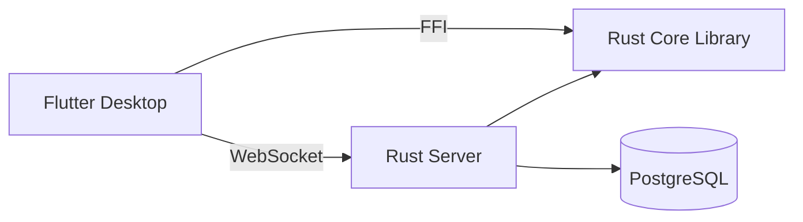

# Are You Ghost? 👻🎮

[](LICENSE)
[](https://www.rust-lang.org)
[](https://flutter.dev)

A desktop-first multiplayer social deduction game where players must identify the "ghost" among them through discussion and voting. Built with **Flutter** for the frontend and **Rust** for the backend engine.

## 🎮 About the Game

**Are You Ghost?** is a social deduction game inspired by Mafia and Werewolf. Players engage in rounds of discussion and voting to identify hidden ghost players before it's too late.

**Features:**
- 🏠 **Multiplayer Lobbies** - Support for up to 16 players per room
- 💬 **Real-Time Chat** - In-game discussion during day phases
- 🗳️ **Voting Mechanics** - Democratic elimination system
- 🖥️ **Desktop-Optimized** - Native Windows application (Mac/Linux planned)
- 🌐 **Network Play** - Connect via Cloudflare Tunnel for easy multiplayer

## 📋 Table of Contents

- [Architecture](#-architecture)
- [Quick Start](#-quick-start)
- [Installation](#-installation)
- [Development](#-development)
- [Project Structure](#-project-structure)
- [Documentation](#-documentation)
- [Contributing](#-contributing)
- [License](#-license)

## 🏗️ Architecture

This is a **monorepo workspace** with clear separation between frontend and backend:

### Components



- **Frontend:** Flutter desktop application (Windows)
- **Core:** Rust library with game logic, networking, and FFI exports
- **Server:** Standalone Axum HTTP/WebSocket server
- **Database:** PostgreSQL for persistent storage

### Technology Stack

| Layer | Technology |
|-------|------------|
| **Frontend** | Flutter (Desktop), Dart |
| **Backend** | Rust 2021, Tokio (async runtime) |
| **Server** | Axum (HTTP/WebSocket framework) |
| **Database** | PostgreSQL 16, sqlx |
| **FFI Bridge** | flutter_rust_bridge |
| **Networking** | Custom TCP/UDP stack (OSI Layers 4-7) |

**[→ Detailed Architecture Documentation](docs/ARCHITECTURE.md)**

## 🚀 Quick Start

### Prerequisites

- [Rust](https://www.rust-lang.org/tools/install) (latest stable)
- [Flutter](https://flutter.dev/docs/get-started/install) (latest stable)
- [Visual Studio](https://visualstudio.microsoft.com/vs/community/) (with C++ build tools)
- [Docker Desktop](https://www.docker.com/products/docker-desktop) (for PostgreSQL)
- [Git](https://git-scm.com/downloads)

### Run the Server

```powershell
# Start database
docker-compose up -d

# Run server
cargo run -p areyoughost_server
```

The server will start on http://localhost:3000

### Run the Flutter App

```powershell
cd frontend
flutter pub get
flutter run -d windows
```

The desktop app will launch in a centered window.

## 📦 Installation

### 1. Clone the Repository

```powershell
git clone https://github.com/we9d/areyoughost.git
cd areyoughost
```

### 2. Set Up Flutter

**Windows Installation:**
1. Extract Flutter SDK to `C:\flutter`
2. Add `C:\flutter\bin` to your PATH:
   - Search "Edit the system environment variables"
   - Click "Environment Variables"
   - Under "User variables", edit "Path"
   - Add new entry: `C:\flutter\bin`
   - Click OK on all windows
3. Verify installation:
   ```powershell
   flutter --version
   ```

### 3. Configure Visual Studio

Install Visual Studio with these workloads:
- **Desktop development with C++**

Required components:
- MSVC v143 - VS 2022 C++ x64/x86 build tools
- Windows 10 SDK or Windows 11 SDK
- C++ CMake tools for Windows

### 4. Install Rust

Download and run: [rustup-init.exe (x64)](https://www.rust-lang.org/tools/install)

Verify installation:
```powershell
rustc --version
cargo --version
```

### 5. Set Up Environment

Copy the environment template:
```powershell
Copy-Item .env.example -Destination .env
```

Edit `.env` with your local configuration (defaults work for development).

### 6. Start PostgreSQL

```powershell
docker-compose up -d
```

This starts:
- PostgreSQL on `localhost:5432`
- PgAdmin on http://localhost:8080

### 7. Build the Project

**Build Rust workspace:**
```powershell
cargo build --workspace
```

**Install Flutter dependencies:**
```powershell
cd frontend
flutter pub get
```

## 💻 Development

### Running Components

**Backend Server:**
```powershell
cargo run -p areyoughost_server
```

**Flutter Desktop App:**
```powershell
cd frontend
flutter run -d windows
```

**Database Management:**
- PgAdmin: http://localhost:8080
  - Email: `admin@areyoughost.com`
  - Password: `admin`

### Code Quality

**Format code:**
```powershell
cargo fmt --all
```

**Run linter:**
```powershell
cargo clippy --workspace --all-targets
```

**Run tests:**
```powershell
cargo test --workspace
```

**[→ Full Development Guide](docs/DEVELOPMENT.md)**

## 📁 Project Structure

```
areyoughost/
├── core/                 # Rust core library (game logic + networking)
│   ├── src/
│   │   ├── api.rs       # FFI exports to Flutter
│   │   ├── game_logic/  # Game state machine
│   │   ├── network/     # Custom TCP/UDP networking
│   │   ├── db/          # PostgreSQL integration
│   │   └── models.rs    # Shared data structures
│   └── Cargo.toml
│
├── server/              # Standalone HTTP/WebSocket server
│   ├── src/
│   │   └── main.rs
│   └── Cargo.toml
│
├── frontend/            # Flutter desktop application
│   ├── lib/
│   │   ├── ui/         # Screen widgets
│   │   ├── services/   # API service layer
│   │   ├── state/      # State management
│   │   └── ffi/        # Rust FFI bindings
│   └── pubspec.yaml
│
├── docs/                # Documentation
│   ├── ARCHITECTURE.md
│   ├── DEVELOPMENT.md
│   └── PROTOCOL.md
│
├── examples/            # Code examples
├── scripts/             # Build and deployment scripts
├── docker-compose.yml   # PostgreSQL setup
├── Cargo.toml          # Workspace configuration
└── README.md           # This file
```

## 📖 Documentation

- **[Architecture Overview](docs/ARCHITECTURE.md)** - System design and component interaction
- **[Development Guide](docs/DEVELOPMENT.md)** - Setup, workflow, and debugging
- **[Protocol Specification](docs/PROTOCOL.md)** - Custom network protocol details
- **[Contributing Guide](CONTRIBUTING.md)** - How to contribute
- **[Cloudflare Tunnel Setup](CLOUDFLARE_TUNNEL.md)** - External server deployment

## 🌐 Network Protocol

The game implements a **custom TCP-based protocol** with full control over OSI layers 4-7:

- **Layer 7 (Application):** Game messages (login, vote, chat)
- **Layer 6 (Presentation):** Binary serialization, optional compression
- **Layer 5 (Session):** Connection state, session management
- **Layer 4 (Transport):** Raw TCP/UDP sockets, bandwidth control

**Features:**
- Custom packet format with sequence numbers
- QoS priority levels (Critical → High → Medium → Low)
- Configurable bandwidth throttling
- Heartbeat and keepalive mechanisms

**[→ Protocol Specification](docs/PROTOCOL.md)**

## 🔧 Development Status

**Current Phase:** Network Stack Implementation

### Completed ✅
- [x] Project structure and workspace setup
- [x] Flutter UI screens (Login, Lobby, Game)
- [x] HTTP/WebSocket server with health checks
- [x] Docker-based PostgreSQL setup
- [x] FFI bridge configuration
- [x] Cloudflare Tunnel integration
- [x] Comprehensive documentation

### In Progress 🚧
- [ ] Custom network stack (TCP/UDP)
- [ ] Game state machine implementation
- [ ] Database schema and migrations
- [ ] Real-time multiplayer synchronization
- [ ] Role distribution system
- [ ] Vote counting and win conditions

### Planned ⏳
- [ ] Complete game logic (all roles)
- [ ] Replay system
- [ ] Player statistics
- [ ] Matchmaking system
- [ ] Mobile support (iOS/Android)

## 🤝 Contributing

Contributions are welcome! Please read our [Contributing Guide](CONTRIBUTING.md) for:

- Code style guidelines
- Development workflow
- Pull request process
- Testing requirements

**[→ Contributing Guide](CONTRIBUTING.md)**

## 📄 License

This project is dual-licensed under:
- **MIT License** ([LICENSE-MIT](LICENSE-MIT))
- **Apache License 2.0** ([LICENSE-APACHE](LICENSE-APACHE))

You may choose either license for your use.

## 🔗 Resources

- [Rust Book](https://doc.rust-lang.org/book/)
- [Flutter Documentation](https://flutter.dev/docs)
- [Tokio Async Runtime](https://tokio.rs)
- [Axum Web Framework](https://docs.rs/axum/)
- [sqlx Database Library](https://docs.rs/sqlx/)

## 👥 Team

**This hole has a story team**

---

**Built with ❤️ using Rust and Flutter**
