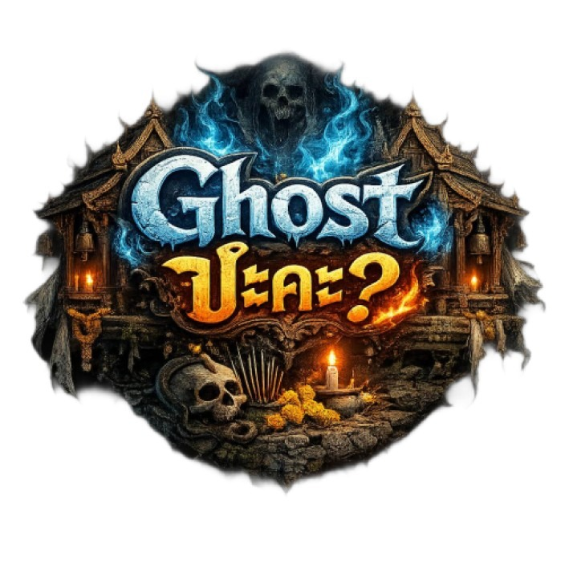
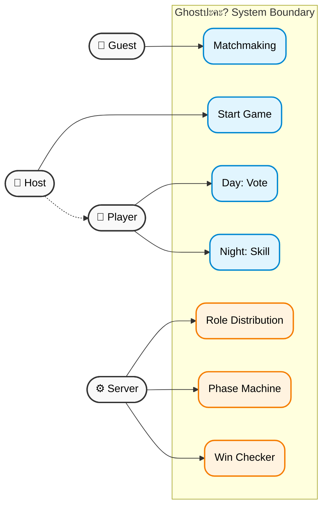
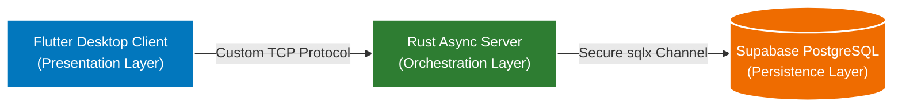

# Ghostปะคะ? (Are You Ghost?) 👻🎮

<p align="center">
  
  <br>
  <i>A High-Performance Social Deduction Engine built for Network Excellence.</i>
</p>

---

## 🎭 Overview
**Are You Ghost?** is a desktop-first social deduction game inspired by Mafia and Werewolf. This project is meticulously engineered to demonstrate a deep understanding of **Modern Network Architecture** and the **OSI Model**, transitioning from standard HTTP/WebSockets to a **custom-built binary TCP protocol**.

### ✨ Core Features
- 🏠 **Multiplayer Lobbies**: Dynamic room management for up to 16 players.
- 💬 **Real-Time Synchronous Chat**: Zero-latency discussion via custom protocol.
- 🗳️ **Democratic Voting**: Orchestrated server-side resolution for player elimination.
- 🖥️ **Desktop Native**: Premium Flutter experience optimized for high-resolution desktop environments.
- 🔌 **Custom TCP Engine**: A proprietary network stack built from raw sockets.
- 🔒 **Fortified Security**: Strict Client-Server isolation with zero client-side DB exposure.

---

## 🏗️ Architecture & Tech Stack

This project follows a dedicated **Monorepo Architecture** with a clear separation of concerns, communicating via the **Areyoughost Binary Protocol**.

> [!TIP]
> **Technical Deep Dive**: For in-depth details, see our [**Architecture Guide**](docs/ARCHITECTURE.md) and [**Protocol Specification**](docs/PROTOCOL.md).

### 📊 Functional Overview
The following diagram illustrates the interaction between users and the automated game engine.



### 🧩 System Design


### 🛠️ Technology Stack
| Layer | Technology | Role |
| :--- | :--- | :--- |
| **Frontend** | `Flutter (Dart)` | High-fidelity UI & Raw Socket Handling |
| **Backend** | `Rust (Tokio)` | Async High-Throughput Packet Processing |
| **Database** | `Supabase (PostgreSQL)` | Enterprise-grade Persistence & Auth |
| **Networking** | `dart:io` & `tokio::net` | Custom L4-L7 OSI Implementation |

---

## 🔒 Security & Client Isolation
Security is a non-negotiable pillar of our design. Our **Client Isolation Policy** ensures that:
- **Zero Credentials**: The client has no knowledge of the Supabase API keys or Database URL.
- **Server Authority**: The Rust backend acts as the sole gatekeeper for all state mutations.
- **Encrypted Env**: Sensitive keys are managed via server-side `.env` and never leaked in version control.

---

## 🌐 OSI Model Implementation
Built for the **Data Communications and Network Course**, this project maps directly to the OSI standard:

> [!NOTE]
> **Layer 7 (Application)**: Proprietary commands (JOIN, CHAT, VOTE) governing game logic.  
> **Layer 6 (Presentation)**: Efficient binary serialization using `serde` and `bincode`.  
> **Layer 5 (Session)**: UUID-based lifecycle management and stateful session tracking.  
> **Layer 4 (Transport)**: Raw TCP streams ensuring ordered and reliable packet delivery.

---

## 📦 Areyoughost Binary Protocol
Our custom protocol is optimized for low-bandwidth and high-reliability scenarios.

**Frame Structure:**
| Magic bytes (2B) | Cmd Type (1B) | Payload Len (4B) | Payload (NB) | CRC16 (2B) |
| :--- | :--- | :--- | :--- | :--- |
| `0xAE 0x80` | `0x01` | `0x000000FF` | `{Data}` | `0xFFFF` |

---

## 🚀 Quick Start & Deployment

### 1. Prerequisites
- **Rust Toolchain**: Latest stable.
- **Flutter SDK**: Latest stable.
- **Docker**: For local database orchestration.
- **Wireshark**: For real-time TCP packet analysis & verification.

### 2. Launch Sequence
```powershell
# 1. Initialize Database
docker-compose up -d

# 2. Ignite Backend Server (Default bind: 127.0.0.1:8080)
cargo run -p areyoughost_server

# 3. Launch Desktop UI
cd frontend
flutter run -d windows
```

---

## 🌍 Academic Demonstration
For deployment testing, the server is designed to run in a **KVM-bridged Ubuntu environment**. This enables true Layer 3 routing where clients connect via the local network to a distinct virtual IP, proving the protocol's robustness outside of a loopback environment.

---

**Team**: *This hole has a story team*  
**Course**: *Data Communications and Network*  
**Built with ❤️ using Rust and Flutter**

MAX_PACKET_SIZE=4096
Team: This hole has a story teamBuilt for: Data Communications and Network Course