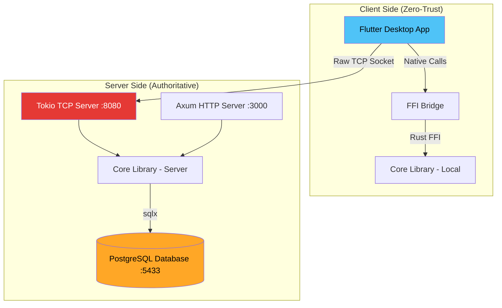
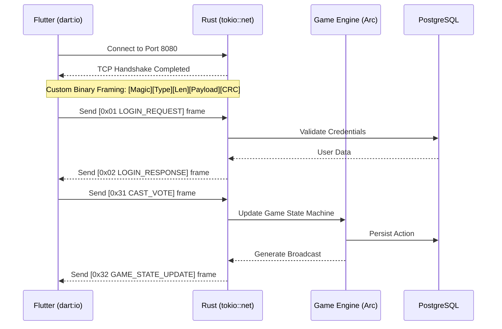

# Architecture Overview

## System Architecture

**Are You Ghost** is a multiplayer social deduction game built with a strict **Zero-Trust Client Isolation** model and a **Dual-Port Server Architecture**, specifically designed to demonstrate low-level networking concepts over TCP.

## High-Level Architecture

## Data Flow (Binary Protocol)
Instead of traditional HTTP/REST, the game state is synchronized using the **Areyoughost Binary Protocol** over raw TCP.

## Technology Decision Rationale

### Why Custom TCP instead of WebSockets?
To fulfill the requirements of the **Data Communications and Network** course, we bypassed Layer 7 frameworks (HTTP/WS) to manually handle Layer 4-6 operations. This includes binary serialization, framing (solving sticky packets via Length headers), and data integrity verification (CRC16).

### Why Arc-based State Management?
The game engine uses `Arc<RwLock<GameState>>` to allow multiple Tokio threads (representing up to 16 concurrent TCP player connections) to read and modify the game state safely without memory corruption or race conditions.

### Why Zero-Trust Client?
The Flutter frontend contains **no database credentials**. It only knows how to serialize user actions into binary frames and send them to Port 8080. The Rust server acts as the absolute authority, protecting against client-manipulation and ensuring database security.
