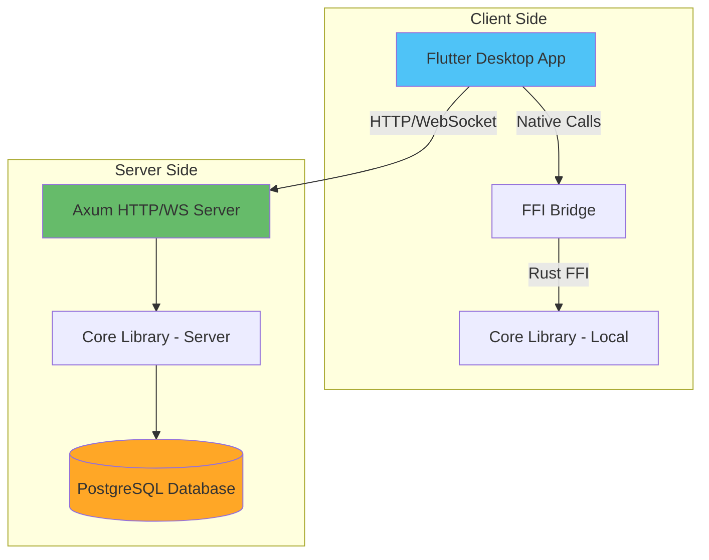
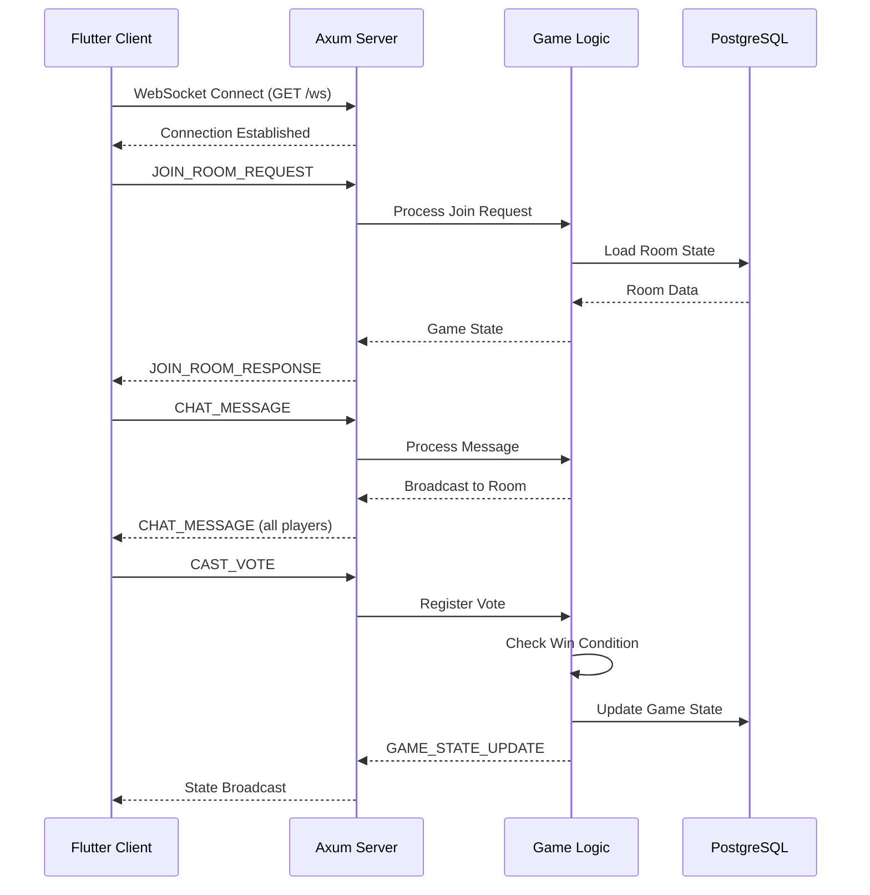
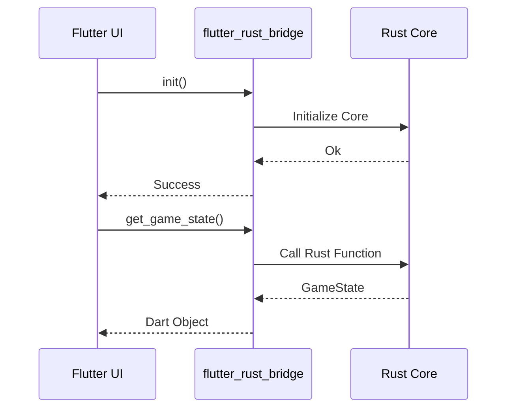
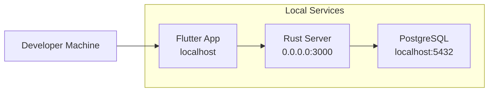
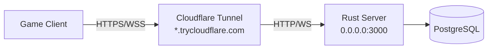

# Architecture Overview

## System Architecture

**Are You Ghost** is a multiplayer social deduction game built with a clear separation between frontend (Flutter) and backend (Rust) components, connected through both FFI and network protocols.

## High-Level Architecture



## Component Breakdown

### 1. Frontend (Flutter Desktop)

**Location:** `frontend/`

**Purpose:** Cross-platform desktop application providing the user interface

**Key Responsibilities:**
- Rendering game screens (Login, Lobby, Game)
- User input handling
- State management
- Communication with backend via WebSocket
- Integration with Rust core via FFI

**Technology:**
- **Framework:** Flutter (Desktop target - Windows)
- **UI:** Material Design components
- **State Management:** Provider/Riverpod (planned)
- **FFI:** `flutter_rust_bridge` for Rust integration

**Directory Structure:**
```
frontend/lib/
├── ui/              # Screen widgets
├── ffi/             # FFI bindings to Rust
├── state/           # Application state
├── services/        # API and service layer
├── models/          # Data models
└── theme/           # UI theming
```

---

### 2. Core Library (Rust)

**Location:** `core/`

**Purpose:** Shared game logic and networking primitives

**Key Responsibilities:**
- Game state machine implementation
- Role distribution logic
- Vote counting and win condition checking
- Network protocol handling (TCP/UDP)
- Database operations (PostgreSQL via sqlx)
- FFI exports for Flutter

**Technology:**
- **Language:** Rust 2021 Edition
- **Async Runtime:** Tokio
- **Database:** sqlx (PostgreSQL)
- **FFI:** flutter_rust_bridge
- **Serialization:** serde, serde_json

**Module Structure:**
```
core/src/
├── api.rs           # FFI exports to Flutter
├── game_logic/      # Game state machine
│   ├── state.rs
│   ├── roles.rs
│   ├── phase_machine.rs
│   ├── vote_system.rs
│   ├── chat_system.rs
│   └── win_checker.rs
├── network/         # Custom network stack
│   ├── tcp_client.rs
│   ├── tcp_server.rs
│   ├── message.rs
│   └── bandwidth.rs
├── db/              # Database layer
│   └── postgres.rs
├── models.rs        # Shared data structures
└── utils.rs         # Helper functions
```

**Crate Type:** Both `lib` and `cdylib` for FFI support

---

### 3. Server Binary (Rust)

**Location:** `server/`

**Purpose:** Standalone HTTP/WebSocket server for multiplayer functionality

**Key Responsibilities:**
- Accept client connections
- Manage game rooms
- Broadcast game state updates
- Coordinate between players
- Persist game data to database

**Technology:**
- **Framework:** Axum (HTTP/WebSocket)
- **Async Runtime:** Tokio
- **Middleware:** Tower, Tower-HTTP (CORS, tracing)
- **Logging:** tracing, tracing-subscriber

**Endpoints:**
- `GET /` - Health check
- `GET /health` - Health check (alias)
- `GET /ws` - WebSocket connection for game communication

**Configuration:**
- Binds to `0.0.0.0:3000` for external access
- CORS enabled for browser clients
- Compatible with Cloudflare Tunnel

---

### 4. Database Layer

**Technology:** PostgreSQL 16

**Purpose:** Persistent storage for game data

**Managed Via:** Docker Compose

**Schema Areas:**
- User accounts and authentication
- Game rooms and sessions
- Player statistics
- Game history and replays

**Access:**
- **Application:** Via `sqlx` from Rust core
- **Management:** PgAdmin (http://localhost:8080)
- **Migration:** sqlx migrations (planned)

---

## Data Flow

### Game Session Flow



### FFI Integration Flow



---

## Network Architecture

### Custom Protocol Stack (OSI Layers 4-7)

The game implements a custom network protocol for fine-grained control:

```
┌─────────────────────────────────────┐
│  Layer 7: Application Layer         │
│  - Game Messages (Login, Vote, etc) │
│  - Command/Response Pattern         │
└─────────────────────────────────────┘
┌─────────────────────────────────────┐
│  Layer 6: Presentation Layer        │
│  - Binary Serialization (serde)     │
│  - Optional Compression (LZ4/Zstd)  │
└─────────────────────────────────────┘
┌─────────────────────────────────────┐
│  Layer 5: Session Layer             │
│  - Connection State Management      │
│  - Session ID (UUID v4)             │
└─────────────────────────────────────┘
┌─────────────────────────────────────┐
│  Layer 4: Transport Layer           │
│  - Raw TCP/UDP Sockets (Tokio)      │
│  - Bandwidth Throttling (QoS)       │
└─────────────────────────────────────┘
```

**See:** [PROTOCOL.md](PROTOCOL.md) for detailed specification

---

## Deployment Architecture

### Development Environment



### Production Environment (with Cloudflare Tunnel)



**Advantages:**
- No port forwarding required
- Free HTTPS/WSS encryption
- DDoS protection
- Global CDN

---

## Technology Decision Rationale

### Why Rust for Backend?

1. **Performance:** Low latency for real-time multiplayer
2. **Safety:** Memory safety without garbage collection
3. **Concurrency:** Fearless concurrency with Tokio
4. **FFI:** Easy integration with Flutter via C bindings
5. **Custom Networking:** Low-level control for custom protocols

### Why Flutter for Frontend?

1. **Cross-Platform:** Single codebase for Windows/Mac/Linux
2. **Performance:** Native rendering performance
3. **UI Productivity:** Hot reload, rich widget library
4. **Rust Integration:** Excellent FFI support

### Why PostgreSQL?

1. **ACID Compliance:** Reliable data persistence
2. **Performance:** Efficient for game state queries
3. **JSON Support:** Flexible schema for game data
4. **Mature Tooling:** Well-supported by sqlx

---

## Security Considerations

1. **Password Hashing:** bcrypt/argon2 (planned)
2. **Session Management:** UUID v4 tokens with expiration
3. **Input Validation:** All user input sanitized
4. **Rate Limiting:** Prevent DoS attacks
5. **SQL Injection:** Prevented via sqlx compile-time checking

---

## Performance Considerations

### Bandwidth Management

- **Default Limit:** 1 MB/s per connection
- **QoS Priorities:** Critical > High > Medium > Low
- **Throttling:** Token bucket algorithm
- **Configurable:** Via environment variables

### Database Optimization

- **Connection Pooling:** sqlx managed pool
- **Prepared Statements:** Compile-time SQL checking
- **Indexing:** On frequently queried fields (room_id, user_id)

### Async Runtime

- **Multi-threaded:** Tokio with work-stealing scheduler
- **Non-blocking I/O:** All network operations async
- **Backpressure:** Bounded channels for message queues

---

## Future Enhancements

1. **Horizontal Scaling:** Multiple server instances with Redis pub/sub
2. **Matchmaking:** Skill-based room assignment
3. **Replay System:** Store and replay game sessions
4. **Analytics:** Player behavior tracking
5. **Mobile Support:** Extend Flutter app to iOS/Android
